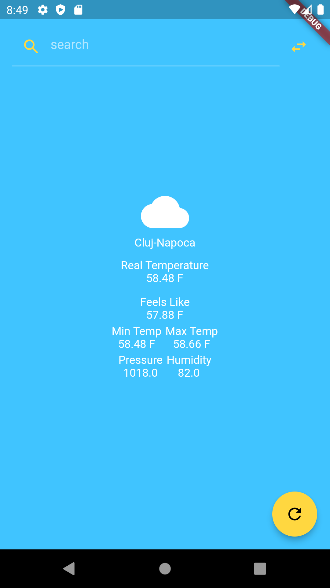

# weather_app

Use this application to check weather conditions for any city.

## Functionalities 

1. Search for a location and see the weather forecast for that location 
2. Toggle between the metric and imperial system when displaying units 
3. Refresh the weather for the selected location....

  

